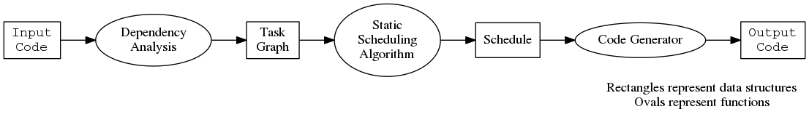
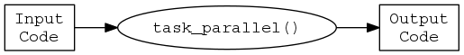
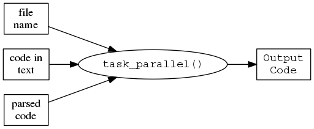
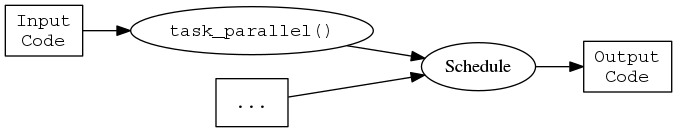
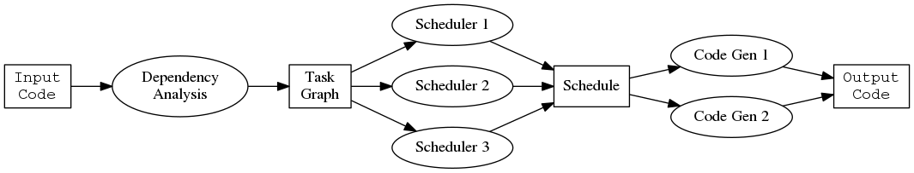

% Customizable and Extensible Code

TODO: I'm still not clear on how Duncan distinguishes between customizable
and extensible.

By extensible, I am referring to infrastructure and more specifically  extensibility via class
extension/subclassing/interfaces in the OOP world.  So we can extend the existing code base
without modifying it by defining one or more new classes (typically derived from an existing
class) and then providing methods for this new class. Then we create a new instance of our new
class and pass it into the existing system and the new methods get invoked appropriately.

By customizable, I mean that we can control the behaviour of a function via its parameters,
and specifically, that we can pass a function in to the function that is used to do a particular
step in that function. The example we discussed was your scheduler parameter which takes a
function that computes the schedule.  By being able to provide a function, we don't have to
define a new class and a new method and then create an instance of that new class to get our new
method invoked. The function is more direct, dynamic and ephemeral. It is in effect for this function call.
	
	
   
   


What does it mean for code to be customizable and extensible? Essentially
it means to leave things flexible and gives freedom to the user. We'll
explore these concepts in the context of a concrete example.

I'm writing software to transform regular R code into a version that uses
task parallelism, which means that different code blocks execute
simultaneously. I have the following computational model in mind:



The package contains a function `task_parallel` implementing the above
steps, so users write:

```{r}
newcode = task_parallel(oldcode)
```

We discuss how to design this function `task_parallel` to be flexibile and
customizable with respect to the four objects in the diagram:

- input code
- task graph
- schedule
- output code

and with respect to the three functions in the diagram:

- dependency analysis
- scheduling algorithm
- code generator

This document demonstrates incremental steps to make functions more
extensible and customizable.


## Simple

Here's the simplest way to implement `task_parallel`:

```{r}
task_parallel = function(code)
{
    tg = task_graph(code)
    sc = scheduler(tg)
    code_generator(sc)
}
```

This has the advantage of simplicity for the user, because it implies the
following mental model.



`task_parallel()` is a black box, completely abstracted away. 
The user only controls what code they pass in. We've hard coded the
scheduling algorithm and code generator so that the user has no control
over the behavior of the `task_parallel` function.

As we make the function customizable and extensible we would like to always
keep this simple behavior that allows users to write `autoparallel(code)`.
It's simple, it's the most common use case, and it includes users who don't
care about understanding any of the underlying mental models, they just
want the end result.


## Multiple Inputs

The user may prefer to pass in different types of input to `task_parallel`.
For example, they may have the name of a file containing code,
a bunch of code in a character vector,
or maybe a language object produced by R's `parse()` function.



We can keep the current definition for `task_parallel` and achieve this
behavior by dispatching `task_graph` on the class of the
input `code`. This is the right choice, because then `task_graph` becomes
flexible and propagates this flexibility through to the calling function
`task_parallel`. In S3 our code might look like the following:

```{r}
task_graph = function(code, ...)
{
    UseMethod("task_graph")
}

task_graph.character = function(code, ...)
{
    # ... Disambiguate file names from a character vector
    TODO: use of I() here
    task_graph(parse(filename))
}
    
task_graph.expression = function(code, ...)
{
    # The actual work of building a task graph
}
```


`task_parallel` can handle different types of `code` arguments in 
in two other ways, both of which have
problems. First, we could make `task_parallel` itself a method that
dispatched on the class of `code`. This will confuse things when we
generalize `task_parallel` later. Second, we could add statements of the
form `if(class(code)) == "character"` inside the body of `task_parallel`.
This might be warranted if we're sure that the conditions are simple and
will stay simple, but when they grow more complex we will be better
served by object oriented programming. These two approaches share the
common problem of not generalizing the behavior of the underlying function
`task_graph`.

## Passing Arguments Through

The scheduler happens to be the most complex step in the process, and we
would like to provide a way for users to easily control these parameters.
R's ellipses `...` provide a mechanism for this.
Note that it really only makes sense to use this with a single function.

```{r}
task_parallel = function(code, ...)
{
    tg = task_graph(code)
    sc = scheduler(tg, ...)
    code_generator(sc)
}
```

Now if a user wants to specify another argument to the scheduling step, say
`maxworkers = 3L` to create a schedule with three workers they can easily
do this:

```{r}
newcode = task_parallel(code, maxworkers = 3L)
```




## Customizability

In the original computational model the scheduling algorithm and the code
generation are meant to be modular. Users can customize the
system by supplying their own functions that implement scheduling or code
generation.



The code becomes:

```{r}
task_parallel = function(code, scheduler = default_scheduler, ...
    code_generator = default_code_generator)
{
    tg = task_graph(code)
    sc = scheduler(tg, ...)
    code_generator(sc)
}
```

Now users can define and use their own scheduling algorithms, for example
`genetic_scheduler` that uses a genetic algorithm.

```{r}
newcode = task_parallel(code, genetic_scheduler)
```

Suppose the user wants to modify some part of the pipeline. If the user has
a schedule in hand then they can directly call the code generator, and
there's no need to use `task_parallel`. But they may want to modify the
task graph and pass this directly in. R evaluates arguments lazily, so we
can allow users to pass in a task graph by lifting the first line in the
body of the function into an argument:

```{r}
task_parallel = function(code, tg = task_graph(code), scheduler = default_scheduler,
    ..., code_generator = default_code_generator)
{
    sc = scheduler(tg, ...)
    code_generator(sc)
}
```


## Extensibility

Some schedulers must be tied to their code generators. For example,
`fork_join` is a scheduling algorithm that returns a more specialized
schedule that supports a particular type of code generator. So we don't
want to use the `default_scheduler`.
