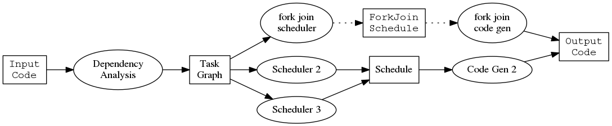

TODO:

- changing `if(class(...` to `as()`
- Calling `I()` on arguments to control behavior

By customizable, we mean that we can control the behaviour of a function via
its parameters, and specifically, that we can pass a function in to the
function that is used to do a particular step in that function. Below we
discuss the scheduler parameter which takes a function that computes the
schedule. By being able to provide a function, we don't have to define a
new class and a new method and then create an instance of that new class to
get our new method invoked. The function is more direct, dynamic and
ephemeral. It is in effect for this function call.
	
By extensible, we are referring to infrastructure and more specifically
extensibility via class extension/subclassing/interfaces in the Object
Oriented Programming (OOP) world. So we can extend the existing code base
without modifying it by defining one or more new classes (typically derived
from an existing class) and then providing methods for this new class. Then
we create a new instance of our new class and pass it into the existing
system and the new methods get invoked appropriately.


## Application

We'll explore these concepts in the context of a concrete example.
The software described below transforms regular R code into a version that uses
task parallelism, which means that different code blocks execute
simultaneously. This graph illustrates the steps:


The package contains a function `task_parallel` implementing the above
steps, so users write:

```{r}
newcode = task_parallel(oldcode)
```

We discuss how to design this function `task_parallel` to be flexibile and
customizable with respect to the four objects in the diagram:

- input code
- task graph
- schedule
- output code

and with respect to the three functions in the diagram:

- dependency analysis
- scheduling algorithm
- code generator

This document demonstrates incremental steps to make functions more
extensible and customizable.


## Simple

Here's the simplest way to implement `task_parallel`:

```{r}
task_parallel = function(code)
{
    tg = task_graph(code)
    sc = scheduler(tg)
    code_generator(sc)
}
```

This has the advantage of convenience for the user, because it implies the
following mental model.


`task_parallel()` is a black box, completely abstracted away. The user only
controls what code they pass in. Sometimes this level of abstraction is
entirely appropriate, as we don't want to force users to have to understand
all aspects of the implementation. Indeed, the entire purpose of a function
is to provide a convenient abstraction. The problem with this
implementation is that it fixes the scheduling algorithm and code generator
so that the user has no control over the behavior of the `task_parallel`
function.

As we make the function customizable and extensible we would like to always
keep this simple behavior that allows users to write `autoparallel(code)`.
It's convenient, it's the most common use case, and it includes users who don't
care about understanding any of the underlying mental models, they just
want the end result.


## Multiple Inputs

The user may prefer to pass in different types of input to `task_parallel`.
For example, they may have the name of a file containing code,
a bunch of code in a character vector,
or maybe a language object produced by R's `parse()` function.


We can keep the current definition for `task_parallel` and achieve this
behavior by making `task_graph` a generic function. This means `task_graph`
will dispatch on the class of the input `code`. This is a better choice
than making `task_parallel` a generic function, because then `task_graph`
becomes flexible and propagates this flexibility through to the calling
function `task_parallel`. In S3 our code might look like the following:

```{r}
task_graph = function(code, ...)
{
    UseMethod("task_graph")
}

task_graph.character = function(code, ...)
{
    # ... Disambiguate file names from a character vector of unparsed code
    TODO: use of I() here
    task_graph(parse(filename))
}
    
task_graph.expression = function(code, ...)
{
    # The actual work of building a task graph
}
```

## Passing Arguments Through

The scheduler happens to be the most complex step in the process, and we
would like to provide a way for users to easily control these parameters.
R's ellipses `...` provide a mechanism for this.
Note that it really only makes sense to use this with a single function.

```{r}
task_parallel = function(code, ...)
{
    tg = task_graph(code)
    sc = scheduler(tg, ...)
    code_generator(sc)
}
```

Now if a user wants to specify another argument to the scheduling step, say
`maxworkers = 3L` to create a schedule with three workers they can easily
do this:

```{r}
newcode = task_parallel(code, maxworkers = 3L)
```


We could take this further and pass in further arguments in the form of a
list from `task_parallel` in to the other steps `task_graph` and
`code_generator`. We are not doing this at the moment for two reasons. First,
we don't currently see a need for specifying many arguments for these two
functions. Second, it's easy to add later without breaking anything.

## Customizability

In the original computational model the scheduling algorithm and the code
generation are meant to be modular. Users can customize the
system by supplying their own functions that implement scheduling or code
generation.


The code becomes:

```{r}
task_parallel = function(code, scheduler = default_scheduler, ...
    code_generator = default_code_generator)
{
    tg = task_graph(code)
    sc = scheduler(tg, ...)
    code_generator(sc)
}
```

Now users can define and use their own scheduling algorithms, for example
`genetic_scheduler` that uses a genetic algorithm.

```{r}
newcode = task_parallel(code, genetic_scheduler)
```

Suppose the user wants to modify some part of the pipeline. If the user has
a schedule in hand then they can directly call the code generator, and
there's no need to use `task_parallel`. But they may want to modify the
task graph and pass this directly in. R evaluates arguments lazily, so we
can allow users to pass in a task graph by lifting the first line in the
body of the function into a default parameter:

```{r}
task_parallel = function(code, taskgraph = task_graph(code), scheduler = default_scheduler,
    ..., code_generator = default_code_generator)
{
    sc = scheduler(taskgraph, ...)
    code_generator(sc)
}
```

We could even lift several lines into default parameters, provided that we
avoid circular references.

## Extensibility

Some schedulers must be tied to their code generators. We want the runtime
to figure out what the most appropriate code generator is and use that.
This is where the extensibility through object oriented programming comes
in. We change the __package code__ as follows:

```{r}
generate_code = function(schedule, ...)
{
    UseMethod("generate_code")
}

generate_code.default = function(schedule, ...)
{
    # ... more code here ...
}
```

At this point two of the three steps in the model use methods. We may as
well be consistent and make the scheduling step a method, even though we
don't expect to dispatch on many different classes of task graphs.

```{r}
schedule = function(taskgraph, maxworkers = 2L, ...)
{
    UseMethod("schedule")
}

schedule.default = function(taskgraph, maxworkers, ...)
{
    # ... more code here ...
    class(result) = "Schedule"
    result
}
```

The primary function becomes:

```{r}
task_parallel = function(code, taskgraph = task_graph(code),
    scheduler = schedule, ..., code_generator = generate_code)
{
    sc = scheduler(tg, ...)
    code_generator(sc)
}
```

Now we can extend the system through object oriented programming. For
example, `fork_join_schedule` is a scheduling algorithm that returns a more
specialized schedule that supports a particular type of code generator.
Then we don't want to use the `default_code_generator`. By using a generic
function the _user_ __OR__ the package author can define a scheduling
algorithm with an associated implementation as follows:

```{r}
fork_join_schedule = function(taskgraph, maxworkers = 2L, ...)
{
    # ... more code here ...
    class(result) = c("ForkJoinSchedule", "Schedule")
    result
}

generate_code.ForkJoinSchedule = function(schedule, ...)
{
    # ... more code here ...
}
```

We can call this new code as follows:

```{r}
task_parallel(code, scheduler = fork_join_schedule)
```

`fork_join_schedule` creates an object of class `ForkJoinSchedule`, and
`generate_code` will dispatch to the specialized method. These objects
become implicitly tied together which is what we wanted.



## Summary

We started with a function `task_parallel` that could only be called in one
simple way:

- `task_parallel(code)`.

We preserved this desirable simple behavior and extended it so that users can do any
of the following:

- `task_parallel("some_script.R")` methods for different classes of
  the first argument.
- `task_parallel(taskgraph = tg)` skips the setup part of the function in
  case the user has already done that or they have a special task graph to
  use.
- `task_parallel(code, schedule = my_scheduler, code_generator =
  my_code_generator)` allows users to customize the steps in the process
    by passing in their own functions to perform them.
- `task_parallel(code, schedule = fork_join_schedule)` dispatches on the
  class allowing users to extend the system through defining their own
  classes.

This style of code accommodates three increasingly sophisticated classes of
users:

1. Users who just want to treat it as a black box
2. Users who understand the model and would like to experiment by passing
   in new functions
3. Users who would like to extend and build upon the system by writing
   methods and using object oriented programming techniques

The final version of the code supports all of these use cases
simultaneously. Further, we don't force users to do it in any particular
way. This is nice as each usage style has its merits.

## Appendix - Final code

```{r}
# Different inputs
#------------------------------------------------------------

task_graph = function(code, ...)
{
    UseMethod("task_graph")
}

task_graph.character = function(code, ...)
{
    # ... Disambiguate file names from a character vector
    task_graph(parse(filename))
}
    
task_graph.expression = function(code, ...)
{
    # The actual work of building a task graph
}


# Allows extension through intermediate objects
#------------------------------------------------------------

generate_code = function(schedule, ...)
{
    UseMethod("generate_code")
}

generate_code.default = function(schedule, ...)
{
    # ... more code here ...
}

schedule = function(taskgraph, maxworkers = 2L, ...)
{
    UseMethod("schedule")
}

schedule.default = function(taskgraph, maxworkers, ...)
{
    # ... more code here ...
    class(result) = "Schedule"
    result
}


# Final user facing function
#------------------------------------------------------------

task_parallel = function(code, taskgraph = task_graph(code),
    scheduler = schedule, ..., code_generator = generate_code)
{
    sc = scheduler(tg, ...)
    code_generator(sc)
}
```
